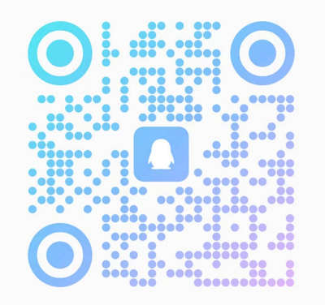

# 微信支付 API v3 Python SDK

[](https://badge.fury.io/py/wechatpayv3)
[](https://img.shields.io/pypi/dm/wechatpayv3)

**当前代码库中只有后端的演示代码，欢迎大家贡献前端各个类型应用调起支付的演示代码。**

## 介绍

微信支付接口 V3 版 python 库。

欢迎微信支付开发者扫码进 QQ 群(群号：973102221)讨论，欢迎提交代码，欢迎star、follow、fork：



## 适用对象

**wechatpayv3**同时支持微信支付[直连模式](https://pay.weixin.qq.com/wiki/doc/apiv3/index.shtml)及[服务商模式](https://pay.weixin.qq.com/wiki/doc/apiv3_partner/index.shtml)，接口说明详见官网。

## 特性

1. 平台证书自动更新，无需开发者关注平台证书有效性，无需手动下载更新，自动验证签名（微信支付平台证书模式）；
2. 支持本地缓存平台证书，初始化时指定平台证书保存目录即可（微信支付平台证书模式）；
3. 敏感信息直接传入明文参数，SDK 内部自动加密，无需手动处理；
4. 回调通知自动验证回调消息，自动解密 resource 对象，并返回解密后的数据；
5. 已适配[直连模式](https://pay.weixin.qq.com/wiki/doc/apiv3/apis/index.shtml)和[服务商模式](https://pay.weixin.qq.com/wiki/doc/apiv3_partner/apis/index.shtml)中除“电商收付通”以外所有 v3 版接口；
6. 兼容通过平台证书模式和平台公钥模式（2024年09月后启用）初始化。

## 源码

[github](https://github.com/minibear2021/wechatpayv3)

[gitee](https://gitee.com/minibear2021/wechatpayv3)

## 安装

```sh
pip install wechatpayv3
```

## 使用方法

### 准备

参考微信官方文档准备好密钥, 证书文件和配置([证书/密钥/签名介绍](https://pay.weixin.qq.com/wiki/doc/apiv3/wechatpay/wechatpay3_0.shtml))

- **商户 API 证书私钥：PRIVATE_KEY**。商户申请商户 API 证书时，会生成商户私钥，并保存在本地证书文件夹的文件 apiclient_key.pem 中。
  > :warning: 不要把私钥文件暴露在公共场合，如上传到 Github，写在客户端代码等。
- **商户 API 证书序列号：CERT_SERIAL_NO**。每个证书都有一个由 CA 颁发的唯一编号，即证书序列号。扩展阅读 [如何查看证书序列号](https://wechatpay-api.gitbook.io/wechatpay-api-v3/chang-jian-wen-ti/zheng-shu-xiang-guan#ru-he-cha-kan-zheng-shu-xu-lie-hao)。
- **微信支付 APIv3 密钥：APIV3_KEY**，是在回调通知和微信支付平台证书下载接口中，为加强数据安全，对关键信息 `AES-256-GCM` 解密时使用的对称加密密钥。

在2024年09月后申请开通的微信支付可能[无法使用接口下载平台证书](docs/Q&A.md#下载平台证书时解析失败)，这种情况下，需要从微信支付后台的“API安全”菜单中下载/复制以下两项，使用公钥模式初始化WechatPay。

- **微信支付公钥：PUBLIC_KEY**，微信支付后台“API安全-微信支付公钥”菜单中下载的微信支付公钥。
- **微信支付公钥ID：PUBLIC_KEY_ID**，微信支付后台“API安全-微信支付公钥”菜单中复制的微信支付公钥ID，形如：PUB_KEY_ID_1234567890...。


### 一个最小的后端

[examples.py](examples/server/examples.py) 演示了一个带有[Native 支付下单](https://pay.weixin.qq.com/wiki/doc/apiv3/apis/chapter3_4_1.shtml)接口和[支付通知](https://pay.weixin.qq.com/wiki/doc/apiv3/apis/chapter3_4_5.shtml)接口的后端。
首先，修改 **examplys.py** 里以下几项配置参数：

```python
# 微信支付商户号，服务商模式下为服务商户号，即官方文档中的sp_mchid。
MCHID = '1230000109'

# 商户证书私钥，此文件不要放置在下面设置的CERT_DIR目录里。
with open('path_to_mch_private_key/apiclient_key.pem') as f:
    PRIVATE_KEY = f.read()

# 商户证书序列号
CERT_SERIAL_NO = '444F4864EA9B34415...'

# API v3密钥， https://pay.weixin.qq.com/wiki/doc/apiv3/wechatpay/wechatpay3_2.shtml
APIV3_KEY = 'MIIEvwIBADANBgkqhkiG9w0BAQE...'

# APPID，应用ID，服务商模式下为服务商应用ID，即官方文档中的sp_appid，也可以在调用接口的时候覆盖。
APPID = 'wxd678efh567hg6787'

# 回调地址，也可以在调用接口的时候覆盖。
NOTIFY_URL = 'https://www.xxxx.com/notify'

# 微信支付平台证书缓存目录，初始调试的时候可以设为None，首次使用确保此目录为空目录。
# 注：2024年09月后新申请的微信支付账号使用公钥模式初始化，此参数无需配置。
CERT_DIR = './cert'

# 日志记录器，记录web请求和回调细节，便于调试排错。
logging.basicConfig(filename=os.path.join(os.getcwd(), 'demo.log'), level=logging.DEBUG, filemode='a', format='%(asctime)s - %(process)s - %(levelname)s: %(message)s')
LOGGER = logging.getLogger("demo")

# 接入模式：False=直连商户模式，True=服务商模式。
PARTNER_MODE = False

# 代理设置，None或者{"https": "http://10.10.1.10:1080"}，详细格式参见[https://requests.readthedocs.io/en/latest/user/advanced/#proxies](https://requests.readthedocs.io/en/latest/user/advanced/#proxies)
PROXY = None

# 请求超时时间配置
TIMEOUT = (10, 30) # 建立连接最大超时时间是10s，读取响应的最大超时时间是30s

# 微信支付平台公钥
# 注：2024年09月后新申请的微信支付账号使用公钥模式初始化，需配置此参数。
with open('path_to_wechat_pay_public_key/pub_key.pem') as f:
    PUBLIC_KEY = f.read()

# 微信支付平台公钥ID
# 注：2024年09月后新申请的微信支付账号使用公钥模式初始化，需配置此参数。
PUBLIC_KEY_ID = 'PUB_KEY_ID_444F4864EA9B34415...'
```

接下来初始化 WechatPay 实例并配置一个合适的接口：

```python
wxpay = WeChatPay(
    wechatpay_type=WeChatPayType.NATIVE,
    mchid=MCHID,
    private_key=PRIVATE_KEY,
    cert_serial_no=CERT_SERIAL_NO,
    apiv3_key=APIV3_KEY,
    appid=APPID,
    notify_url=NOTIFY_URL,
    cert_dir=CERT_DIR,
    logger=LOGGER,
    partner_mode=PARTNER_MODE,
    proxy=PROXY,
    timeout=TIMEOUT)

# 微信支付平台公钥模式初始化，2024年09月之后申请的账号参考使用此模式。
wxpay = WeChatPay(
    wechatpay_type=WeChatPayType.NATIVE,
    mchid=MCHID,
    private_key=PRIVATE_KEY,
    cert_serial_no=CERT_SERIAL_NO,
    apiv3_key=APIV3_KEY,
    appid=APPID,
    notify_url=NOTIFY_URL,
    logger=LOGGER,
    partner_mode=PARTNER_MODE,
    proxy=PROXY,
    timeout=TIMEOUT,
    public_key=PUBLIC_KEY,
    public_key_id=PUBLIC_KEY_ID)

app = Flask(__name__)

@app.route('/pay')
def pay():
    # 以native下单为例，下单成功后即可获取到'code_url'，将'code_url'转换为二维码，并用微信扫码即可进行支付测试。
    out_trade_no = ''.join(sample(ascii_letters + digits, 8))
    description = 'demo-description'
    amount = 1
    code, message = wxpay.pay(
        description=description,
        out_trade_no=out_trade_no,
        amount={'total': amount},
        pay_type=WeChatPayType.NATIVE
    )
    return jsonify({'code': code, 'message': message})
```

检查一下参数无误，现在就可以用 python 解释器来运行：

```shell
$ python examples.py
 * Serving Flask app "examples" (lazy loading)
 * Environment: production
   WARNING: This is a development server. Do not use it in a production deployment.
   Use a production WSGI server instead.
 * Debug mode: off
 * Running on http://127.0.0.1:5000/ (Press CTRL+C to quit)
```

现在访问 <http://127.0.0.1:5000/pay> ，如果一切正常，你会看到下面一串 json 字符串：

```python
{
  "code": 200,
  "message": "{\"code_url\":\"weixin://wxpay/bizpayurl?pr=abcdefghi\"}"
}
```

到这一步统一下单的后端就完成了，现在将 code_url 的值即"weixin://wxpay/bizpayurl?pr=abcdefghi"用[草料](https://cli.im/)转换为二维码即可用微信扫码进行支付测试。

**以上步骤如果不能正确执行，务必仔细检查各项初始化参数，必要的情况下，登录微信支付后台，将所有参数重置。**

Native 支付调试最简单便捷，调试通过没有问题证明初始化参数正确之后，如果需要采用其他（小程序、H5、JSAPI、APP）支付下单，可继续参考 examples.py。

## 常见问题

日常开发对接中的常见问题（**特别是回调验证失败的处理**）请见[这里](docs/Q&A.md)。

## 接口清单

已适配的微信支付 V3 版 API 接口列表明细详见[这里](docs/apis.md)。

部分接口的具体调用方法可以参考[这里](docs/interface.md)。

所有接口的参数类型和值**强烈建议**仔细看一下官方的接口文档。

### 接口函数参数

参数类型对照参考下表：

| 微信支付官方文档声明 | **wechatpayv3 python sdk** |
| -------------------- | -------------------------- |
| string | str |
| int| int |
| object | dict: {} |
| array| list: [] |
| boolean| bool: True, False |
| message| bytes|

### 接口函数返回值

每个接口均同步返回 code 和 message，code 为 web 请求得到的 HTTP 状态码，message 为服务器返回的 json 字符串。
例外：

1. 回调通知（callback）接口将收到的参数解密后返回，回调验证不合规或解密失败则返回 None；
2. 下载账单（download_bill）和消费者投诉 2.0 的图片下载（complaint_image_download）接口返回的 message 为 bytes 类型，直接将 message 写入磁盘即可获得对应的目标文件。
3. 账单下载接口默认返回的是gzip格式的文件，可用gzip库解压后获取实际的账单文件。
